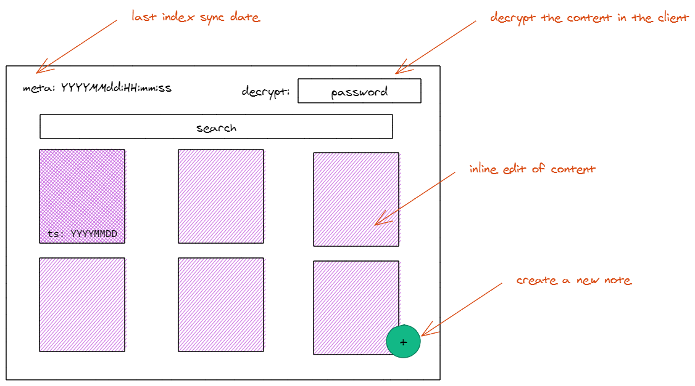
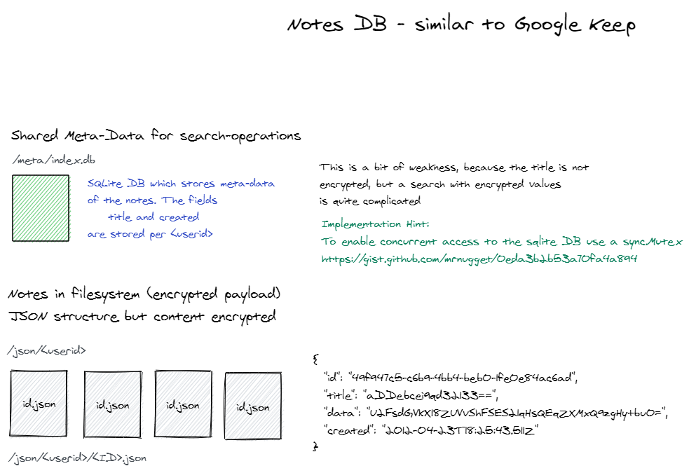
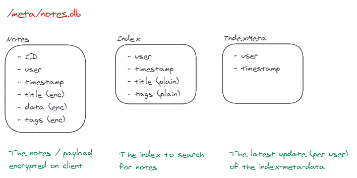

# Google Keep Clone

Implement a very simple note-taking service which works like Google Keep. Integrated into the overall application-frontend. It will be backed by a new microservice/api which is responsible for storing the notes.

## Frontend

Integrated into onefrontend. Use the [angular gridlist]([https://link](https://material.angular.io/components/grid-list/overview)) to show the notes.

## Encryption

All data is stored encrypted. The encryption is done via Browser features @see [javascript-encryption](https://stackoverflow.com/questions/18279141/javascript-string-encryption-and-decryption)

## Backend API

Stores the notes and enables search capabilities.

### Storage

The notes are stored per user. A shared sqlite DB is used to search for notes.

**Hint**: Use the concurrent access pattern via mutexes shown here: [mutex gist](https://gist.github.com/mrnugget/0eda3b2b53a70fa4a894
)

**Idea**: Store the files in AWS-S3, only the index DB is held locally? Refactor S3 access out-of mydms.

The sqlite DB has an index-table for last update/insert timestamp for user. The user can display the index-date and has the last update/insert date of the notes. If the date is off - a index-recreation can be triggered.

**Idea**: Store all within a sqlite DB why use json files?

### Utility

Create a cmd to sync the DB with S3 - create a cron-job to perform the sync.
