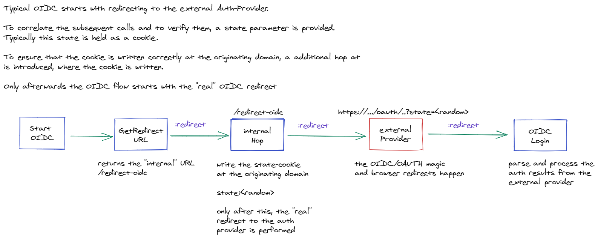

# OIDC
The logic uses an external authentication system (google in this case) which is used to authenticate users. The authorization is done by checking the returned email address of the authentication-provider with the stored permissions and creation a token which is used by downstream services.

## OIDC-process

